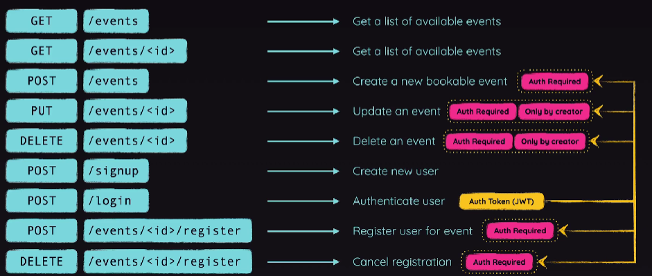

# Project: REST API
## Project Description:
Building a Go-Powered "Event Booking" REST API  

## External Libraries Used:

* [Gin Framework](https://github.com/gin-gonic/gin)
* [SQLite 3 Driver](https://github.com/mattn/go-sqlite3)

## Made by:
João Victor Ferrareis Ribeiro
